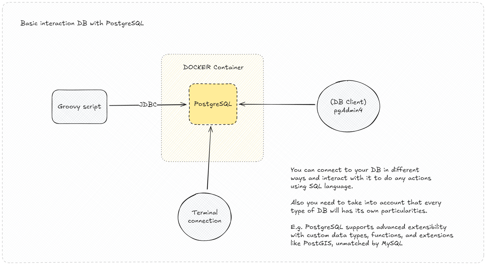
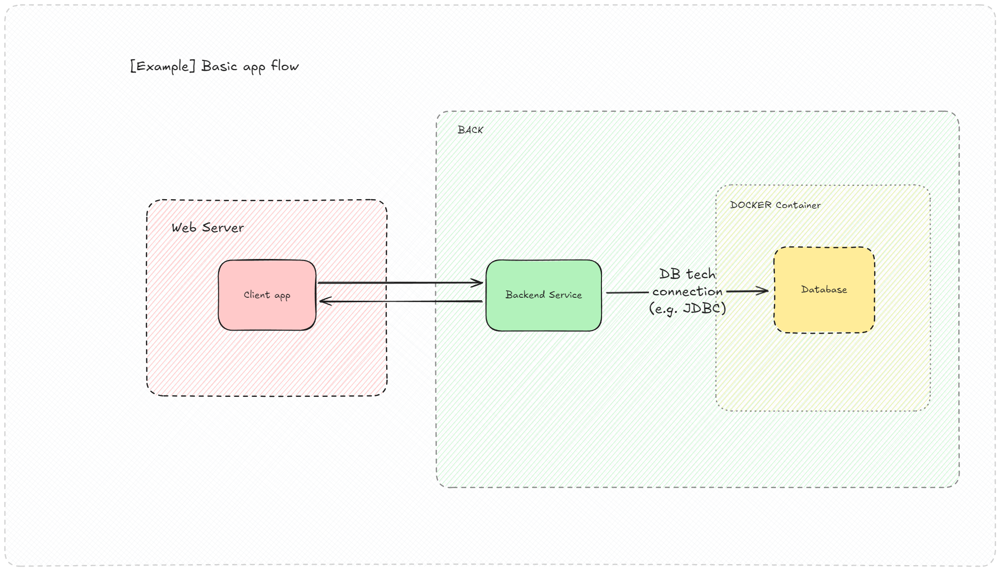

# kf-postgresql-db-sample

This project demonstrates how to use Groovy to execute basic SQL operations on a PostgreSQL database. The database is
initialized using a Docker container with an `init.sql` script, and the project is managed with Maven. It is a simple
test project to showcase database interactions such as **INSERT**, **SELECT**, **UPDATE**, and **DELETE**, as well as *
*INNER JOIN** queries, all written in Groovy.

___

## Table of Contents

- [Graph](#graph)
- [Prerequisites](#prerequisites)
- [Tech Stack](#tech-stack)
- [Features](#features)
- [Key Notes](#key-notes)
- [How to Run](#how-to-run)
- [Interaction](#interaction)
    - [Groovy Script](#groovy-script)
    - [Terminal way to interact with the database](#terminal-way-to-interact-with-the-database)

---

## Graph

Basic Groovy PostgreSQL graph image flow:



Example of a more basic app flow:



---

## Prerequisites

1. **Docker**: Ensure Docker is installed and running.
2. **Maven**: Install Maven to manage dependencies and build the project.
3. **JDK 8+**: A compatible Java Development Kit is required to run the Groovy scripts.

___

## Tech Stack

- **Groovy**: A dynamic programming language for JVM.
- **PostgreSQL**: A powerful, open-source relational database.
- **Docker**: Used to containerize the PostgreSQL instance.
- **Maven**: For project and dependency management.

---

## Features

- **Database Initialization**: A PostgreSQL database is automatically created and seeded using a provided `init.sql`
  script.
- **Groovy Scripting**: Simple Groovy scripts are used to interact with the database using SQL.
- **Dockerized Environment**: The PostgreSQL database runs in a Docker container for easy setup and portability.
- **Maven Build**: Dependency management is handled with Maven, ensuring a smooth build and execution process.

---

## Key Notes

- This project is for **testing purposes only** and is not optimized for production use.
- The Groovy script connects to the PostgreSQL database using the JDBC driver and performs basic SQL operations.
- To extend the project, modify `init.sql` or add more functionality in the Groovy script.

---

## How to Run

1. **Start the PostgreSQL Container**
    - Build and run the Docker container using the provided `Dockerfile`. The database will be initialized using
      `init.sql`.

   Build docker image
   ```bash
   docker build -t kf-postgre-sample-image .
   ```
   Run the container
    ```bash
   docker run -d -p 5432:5432 --name kf-postgre-sample kf-postgre-sample-image
    ```
   Start existing container
    ```bash
   docker start kf-postgre-sample
    ```

___

## Interaction

### **Groovy Script**

- The Groovy script `Main.groovy` contains the main logic for interacting with the PostgreSQL database.
- The script connects to the database using the JDBC driver and executes SQL queries.
- The script demonstrates basic SQL operations such as **INSERT**, **SELECT**, **UPDATE**, and **DELETE**.
- It also showcases an **INNER JOIN** query to fetch data from multiple tables.
- To run the script, execute the following command:
  ```bash
  groovy Main.groovy
  ```

### **Terminal way to interact with the database**

Connect to docker container:

```bash
docker exec -it kf-postgre-sample bash
```

Connect to the database:

```bash
psql -U postgres -d testdb
```

List all databases:

```bash
\l
```

Execute INNER JOIN query:

```sql
SELECT o.id AS order_id, u.name, u.email, o.product, o.amount
FROM orders o
INNER JOIN users u ON o.user_id = u.id
;
```